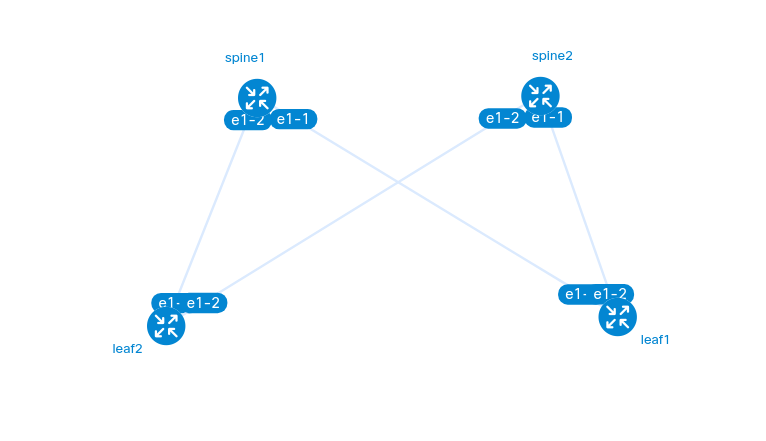

# Network Configuration Management System

A comprehensive Python-based solution for automating multi-device network configuration management for SR Linux devices. This system provides a unified CLI interface for backup, deployment, and rollback operations through Containerlab virtualization.

## Overview

**Purpose:** Automate repetitive network configuration tasks across multiple devices simultaneously. Instead of manually logging into 50 devices to change NTP configuration, define it once and deploy automatically with built-in safety mechanisms.

**Key Value:** Centralized configuration management with automated backups, template-based deployment, and safe rollback capabilities for network infrastructure.

## Core Features

### 1. Unified CLI Interface
- **Single command entry point** (`netconfig.py`) - Git-like command structure
- **5 subcommands** - backup, deploy, rollback, list, validate
- **Professional interface** - Comprehensive help text and examples
- **Global options** - Verbose, quiet, custom config paths

### 2. Configuration Backup
- **Automated timestamped backups** - Version control for configurations
- **Parallel execution** - Fast concurrent backups across multiple devices
- **Role-based filtering** - Backup by device groups (spine/leaf)
- **Backup verification** - Automatic validation of backup files

### 3. Configuration Deployment
- **Jinja2 template-based** - Dynamic configuration generation
- **Dry-run mode** - Preview changes before applying
- **Automatic pre-deployment backup** - Safety backup before every deployment
- **Variable substitution** - Device-specific configuration rendering

### 4. Configuration Rollback
- **Restore from any backup** - Complete configuration history
- **Multiple selection methods** - Latest, specific file, or timestamp
- **Safety backup** - Current config saved before rollback
- **Dry-run preview** - Test rollback without applying

### 5. Multi-Device Operations
- **Parallel execution** - Concurrent operations across multiple devices
- **Device filtering** - Target by name, role, or all devices
- **Comprehensive error handling** - Graceful failure handling with detailed reporting

## Technology Stack

- **Python 3.8+** - Core programming language
- **Netmiko** - SSH automation for network devices
- **Jinja2** - Configuration template engine
- **PyYAML** - Inventory management (YAML)
- **Containerlab** - Lab environment virtualization
- **Nokia SR Linux** - Network operating system
- **Pytest** - Testing framework with coverage reporting

## Quick Start

### 1. Installation

```bash
# Clone repository
git clone <repository-url>
cd network-config-manager

# Create virtual environment
python3 -m venv .venv
source .venv/bin/activate

# Install dependencies
pip install -r requirements.txt

# Verify installation (run tests)
pytest

# Configure credentials (optional)
cp .env.example .env
# Edit .env with your credentials
```

### 2. Deploy Lab (Optional)

```bash
cd lab
sudo containerlab deploy -t topology.yaml
```

### 3. Configure Inventory

Edit `inventory/devices.yaml` with your device details.

### 4. Quick Test

```bash
# Validate setup
python3 netconfig.py validate --inventory
python3 netconfig.py list --devices

# Backup all devices
python3 netconfig.py backup --all

# List templates
python3 netconfig.py list --templates

# View baseline configurations
cat configs/spine1.cfg
cat configs/leaf1.cfg
```

## Unified CLI Usage

The `netconfig.py` command provides a unified interface for all operations:

### Backup Operations

```bash
# Backup all devices
python3 netconfig.py backup --all

# Backup specific devices
python3 netconfig.py backup --device spine1 --device leaf1

# Backup by role
python3 netconfig.py backup --role spine --parallel
```

### Deployment Operations

```bash
# Dry-run deployment (preview only)
python3 netconfig.py deploy -t ntp.j2 --device spine1 \
  --vars '{"ntp_server": "10.0.0.1"}' --dry-run

# Deploy to all devices
python3 netconfig.py deploy -t ntp.j2 --all \
  --vars '{"ntp_server": "10.0.0.1"}'

# Deploy with variables from file
python3 netconfig.py deploy -t snmp.j2 --role spine \
  --vars @variables.json
```

### Rollback Operations

```bash
# Rollback to latest backup
python3 netconfig.py rollback --device spine1 --latest

# Rollback to specific backup file
python3 netconfig.py rollback --device spine1 \
  --backup configs/backups/spine1_20250203_143022.cfg

# Preview rollback (dry-run)
python3 netconfig.py rollback --role spine --latest --dry-run
```

### List Operations

```bash
# List all devices
python3 netconfig.py list --devices

# List backups for device
python3 netconfig.py list --backups spine1

# List available templates
python3 netconfig.py list --templates

# List in JSON format
python3 netconfig.py list --devices --format json
```

### Validation Operations

```bash
# Validate inventory structure
python3 netconfig.py validate --inventory

# Validate specific template
python3 netconfig.py validate --template ntp.j2

# Validate all templates
python3 netconfig.py validate --templates

# Validate backup file
python3 netconfig.py validate --backup configs/backups/spine1.cfg
```

### Global Options

```bash
# Verbose output (debug info)
python3 netconfig.py backup --all --verbose

# Quiet output (errors only)
python3 netconfig.py deploy -t ntp.j2 --all --quiet

# Custom inventory path
python3 netconfig.py --config custom/devices.yaml list --devices

# Show version
python3 netconfig.py --version
```

**Complete documentation:** See [docs/NETCONFIG_USAGE.md](docs/NETCONFIG_USAGE.md)

## Project Structure

```
network-config-manager/
├── netconfig.py             # Unified CLI (main entry point)
├── README.md                # Project documentation
├── requirements.txt         # Python dependencies
├── .gitignore               # Git ignore rules
├── .env.example            # Environment variables template
│
├── src/                    # Core Python modules
│   ├── backup.py           # Backup module
│   ├── deployment.py       # Deployment module
│   ├── rollback.py         # Rollback module
│   ├── connection_manager.py  # SSH connections
│   ├── inventory_loader.py    # Inventory management
│   ├── template_engine.py     # Template rendering
│   ├── utils.py            # Utilities
│   └── exceptions.py       # Custom exceptions
│
├── inventory/              # Device inventory
│   ├── devices.yaml        # Device definitions
│   └── README.md           # Inventory documentation
│
├── configs/                # Configuration management
│   ├── backups/            # Stored backups (timestamped)
│   ├── templates/          # Jinja2 templates (.j2 files)
│   ├── spine1.cfg          # Baseline config for spine1
│   ├── spine2.cfg          # Baseline config for spine2
│   ├── leaf1.cfg           # Baseline config for leaf1
│   └── leaf2.cfg           # Baseline config for leaf2
│
├── docs/                   # Documentation
│   └── NETCONFIG_USAGE.md  # Complete CLI usage guide
│
├── tests/                  # Test suite
│   ├── conftest.py         # Pytest configuration and fixtures
│   ├── test_backup.py      # Backup module tests
│   ├── test_deployment.py  # Deployment module tests
│   ├── test_rollback.py    # Rollback module tests
│   ├── test_connection_manager.py  # Connection tests
│   ├── test_inventory_loader.py    # Inventory tests
│   ├── test_template_engine.py     # Template tests
│   ├── test_utils.py       # Utility function tests
│   └── integration/        # Integration tests
│       └── test_full_workflow.py  # End-to-end workflow tests
│
├── lab/                    # Containerlab topology
│   ├── topology.yaml       # Lab topology definition
│   └── README.md           # Lab documentation
│
└── logs/                   # Application logs (auto-generated)
    └── .gitkeep
```

## Lab Topology

Four-device SR Linux spine-leaf topology with full redundancy:



### Device Details

| Device | Role  | IP Address    | Memory | Description |
|--------|-------|---------------|--------|-------------|
| spine1 | spine | 172.21.20.11  | 1GB    | Core spine switch (redundant pair) |
| spine2 | spine | 172.21.20.12  | 1GB    | Core spine switch (redundant pair) |
| leaf1  | leaf  | 172.21.20.13  | 1GB    | Top-of-Rack switch |
| leaf2  | leaf  | 172.21.20.14  | 1GB    | Top-of-Rack switch |

Full mesh connectivity: each leaf connects to both spines for high availability.

### Resource Considerations

Original Design: The project was initially designed with a 6-device topology (2 spines + 4 leaves) to demonstrate larger-scale network automation. However, each SR Linux device requires approximately 2GB RAM.

Current Configuration: This implementation uses a 4-device topology (2 spines + 2 leaves) which maintains proper spine-leaf architecture with full redundancy while being practical for laptop/workstation environments. Total RAM requirement: ~4GB.

Why 4 Devices (2+2)?
- Maintains true spine-leaf architecture (minimum 2 spines for redundancy)
- No single point of failure - if one spine fails, traffic continues through the other
- Demonstrates all key spine-leaf principles: redundancy, load distribution, scalability
- Practical for resource-constrained lab environments

Spine-Leaf Architecture Benefits:
- High availability: Dual spine redundancy eliminates single point of failure
- Load balancing: Traffic distributed across both spines
- Horizontal scalability: Easy to add more leaf switches
- Predictable latency: All leaves are equal distance (1 hop) from spines

Scalability: The codebase fully supports larger topologies. To scale up:
- Edit [lab/topology.yaml](lab/topology.yaml) to add more spines or leaves
- Update [inventory/devices.yaml](inventory/devices.yaml) accordingly
- Ensure sufficient RAM (1-2GB per device recommended)
- All automation features (parallel execution, error isolation) scale automatically

Note: While larger topologies provide more realistic scenarios, this 4-device setup demonstrates all core concepts and automation capabilities effectively.

### Baseline Configurations

The [configs/](configs/) directory includes baseline configuration files for all lab devices:

- Spine configurations ([spine1.cfg](configs/spine1.cfg), [spine2.cfg](configs/spine2.cfg))
  - 2 uplink interfaces (ethernet-1/1 to ethernet-1/2) connected to leaf switches
  - Management interface with static IP (172.21.20.11-12/24)
  - System information and interface descriptions

- Leaf configurations ([leaf1.cfg](configs/leaf1.cfg), [leaf2.cfg](configs/leaf2.cfg))
  - 2 uplink interfaces (ethernet-1/1 to ethernet-1/2) dual-homed to both spines
  - Management interface with static IP (172.21.20.13-14/24)
  - System information and interface descriptions

These files serve as:
- Reference configurations - Example SR Linux configurations for the lab topology
- Deployment baseline - Starting point for configuration management operations
- Rollback targets - Known-good configurations for testing rollback functionality

## Workflow Examples

### Safe Deployment Workflow

```bash
# 1. Create initial backup
python3 netconfig.py backup --all

# 2. Validate inventory and templates
python3 netconfig.py validate --inventory
python3 netconfig.py validate --template ntp.j2

# 3. Preview deployment (dry-run)
python3 netconfig.py deploy -t ntp.j2 --device spine1 \
  --vars '{"ntp_server": "10.0.0.1"}' --dry-run

# 4. Deploy to single device for testing
python3 netconfig.py deploy -t ntp.j2 --device spine1 \
  --vars '{"ntp_server": "10.0.0.1"}'

# 5. If successful, deploy to all
python3 netconfig.py deploy -t ntp.j2 --all \
  --vars '{"ntp_server": "10.0.0.1"}' --parallel

# 6. Verify and rollback if needed
python3 netconfig.py rollback --device spine1 --latest
```

### Emergency Rollback

```bash
# 1. List available backups
python3 netconfig.py list --backups spine1

# 2. Preview rollback (dry-run)
python3 netconfig.py rollback --device spine1 --latest --dry-run

# 3. Execute rollback
python3 netconfig.py rollback --device spine1 --latest

# 4. Verify device functionality
# (manual verification or monitoring)
```

### Bulk Operations

```bash
# Backup all devices in parallel
python3 netconfig.py backup --all --parallel

# Deploy to all spine switches
python3 netconfig.py deploy -t spine_config.j2 --role spine \
  --vars @spine_vars.json --parallel

# Rollback all leaf switches
python3 netconfig.py rollback --role leaf --latest --parallel --yes
```

### Using Baseline Configurations

```bash
# 1. Review baseline configuration for a device
cat configs/spine1.cfg

# 2. Compare with current device configuration
python3 netconfig.py backup --device spine1
diff configs/spine1.cfg configs/backups/spine1_*.cfg

# 3. Apply baseline configuration (using manual deployment)
# Note: You can use baseline configs as templates or reference for creating
# Jinja2 templates for automated deployment

# 4. Test rollback to baseline configuration
cp configs/spine1.cfg configs/backups/spine1_baseline.cfg
python3 netconfig.py rollback --device spine1 --backup configs/backups/spine1_baseline.cfg --dry-run
```

## Testing

The project includes a comprehensive test suite using pytest with unit and integration tests covering all core modules.

### Test Organization

```
tests/
├── conftest.py                # Shared pytest fixtures
├── test_backup.py             # Backup functionality tests
├── test_deployment.py         # Deployment functionality tests
├── test_rollback.py           # Rollback functionality tests
├── test_connection_manager.py # SSH connection tests
├── test_inventory_loader.py   # Inventory parsing tests
├── test_template_engine.py    # Jinja2 template tests
├── test_utils.py              # Utility function tests
└── integration/
    └── test_full_workflow.py  # End-to-end workflow tests
```

### Running Tests

```bash
# Install test dependencies
pip install -r requirements.txt

# Run all tests
pytest

# Run with verbose output
pytest -v

# Run specific test file
pytest tests/test_backup.py

# Run specific test function
pytest tests/test_backup.py::test_backup_device

# Run tests by marker
pytest -m unit          # Run only unit tests
pytest -m integration   # Run only integration tests
pytest -m "not slow"    # Skip slow tests
```

### Test Coverage

```bash
# Run tests with coverage report
pytest --cov=src --cov-report=html --cov-report=term

# View HTML coverage report
open htmlcov/index.html
```

### Test Markers

The test suite uses pytest markers for test organization:

- `@pytest.mark.unit` - Unit tests (fast, isolated)
- `@pytest.mark.integration` - Integration tests (require components)
- `@pytest.mark.slow` - Tests that take longer to execute
- `@pytest.mark.requires_lab` - Tests requiring Containerlab environment

### Test Fixtures

Shared fixtures in [conftest.py](tests/conftest.py) provide:

- `temp_dir` - Temporary directory for test files
- `test_inventory_file` - Sample inventory YAML
- `test_template_file` - Sample Jinja2 template
- `test_backup_file` - Sample backup configuration
- `mock_device` - Mock device dictionary for testing

### Test Modules

| Module | Coverage | Description |
|--------|----------|-------------|
| [test_backup.py](tests/test_backup.py) | Backup operations | Device backup, parallel execution |
| [test_deployment.py](tests/test_deployment.py) | Deployment | Template rendering, config deployment |
| [test_rollback.py](tests/test_rollback.py) | Rollback | Config restoration, backup selection |
| [test_connection_manager.py](tests/test_connection_manager.py) | Connections | SSH pooling, device connectivity |
| [test_inventory_loader.py](tests/test_inventory_loader.py) | Inventory | YAML parsing, device filtering |
| [test_template_engine.py](tests/test_template_engine.py) | Templates | Jinja2 rendering, variable substitution |
| [test_utils.py](tests/test_utils.py) | Utilities | Helper functions, validation |
| [test_full_workflow.py](tests/integration/test_full_workflow.py) | Integration | End-to-end workflows |

### Continuous Testing

```bash
# Watch mode (requires pytest-watch)
pip install pytest-watch
ptw

# Run tests before commit (recommended)
pytest && git commit -m "Your message"
```

## Architecture

### 4-Layer Design

1. **User Interface Layer** - Unified CLI (`netconfig.py`) with subcommands
2. **Application Logic Layer** - Python modules in `src/` directory
3. **Network Communication Layer** - Netmiko for SSH connections
4. **Network Devices Layer** - SR Linux containers in Containerlab

### Key Modules

- **backup.py** - Configuration backup with parallel execution
- **deployment.py** - Template-based configuration deployment
- **rollback.py** - Configuration restoration from backups
- **connection_manager.py** - SSH connection pooling and management
- **inventory_loader.py** - YAML-based device inventory
- **template_engine.py** - Jinja2 template rendering

## Safety Features

### Built-in Safeguards

✓ **Pre-deployment backups** - Automatic backup before every deployment
✓ **Dry-run mode** - Preview changes without applying
✓ **Safety backups before rollback** - Current config saved before restoration
✓ **Error isolation** - Failures on one device don't affect others
✓ **Comprehensive logging** - Detailed operation logs in `logs/`
✓ **Confirmation prompts** - Interactive confirmation for destructive operations

### Best Practices

1. Always use `--dry-run` first to preview changes
2. Test deployments on a single device before bulk operations
3. Keep automatic backups enabled (default behavior)
4. Use verbose mode (`-v`) for debugging
5. Validate inventory and templates regularly
6. Review logs after operations for detailed information

## Command Reference

| Command | Description | Example |
|---------|-------------|---------|
| `backup` | Backup device configurations | `netconfig.py backup --all` |
| `deploy` | Deploy from templates | `netconfig.py deploy -t ntp.j2 --all` |
| `rollback` | Restore previous configs | `netconfig.py rollback --device spine1 --latest` |
| `list` | List devices/backups/templates | `netconfig.py list --devices` |
| `validate` | Validate inventory/templates | `netconfig.py validate --inventory` |

For detailed command options, use `--help`:
```bash
python3 netconfig.py --help
python3 netconfig.py backup --help
python3 netconfig.py deploy --help
```

## Troubleshooting

### Connection Issues
```bash
# Check inventory
python3 netconfig.py validate --inventory

# List devices
python3 netconfig.py list --devices

# Verbose mode for debugging
python3 netconfig.py backup --device spine1 --verbose
```

### Template Issues
```bash
# Validate template syntax
python3 netconfig.py validate --template mytemplate.j2

# List available templates
python3 netconfig.py list --templates

# Test with dry-run
python3 netconfig.py deploy -t mytemplate.j2 --device test --dry-run
```

### Backup/Rollback Issues
```bash
# List available backups
python3 netconfig.py list --backups spine1

# Validate backup file
python3 netconfig.py validate --backup path/to/backup.cfg

# Check logs
tail -f logs/network_automation.log
```
