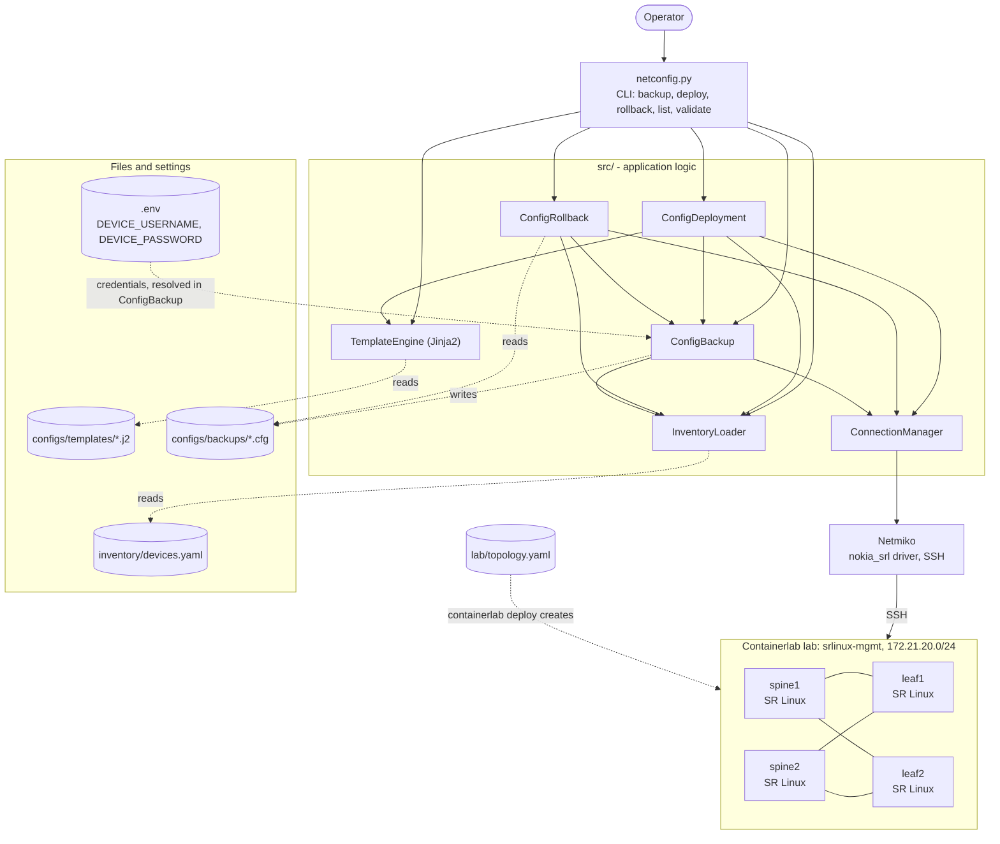
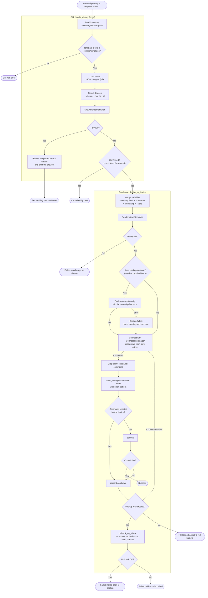

# Architecture

This document shows how the modules fit together and what happens during a deployment. Both diagrams reflect the current code.

## 1. Component diagram

`netconfig.py` is the only entry point. It calls the classes in `src/`, and every operation that touches a device goes through `ConnectionManager`, which uses Netmiko over SSH.

How to read it:

- **CLI**: `netconfig.py` parses the subcommand, picks target devices, shows the plan, asks for confirmation and prints the results. The work is done by `src/`.
- **Inventory**: `InventoryLoader` reads `inventory/devices.yaml`. Credentials in that file are `${DEVICE_USERNAME}` / `${DEVICE_PASSWORD}` placeholders. `ConfigBackup` resolves them from the environment (`.env`), and `ConfigDeployment` and `ConfigRollback` reuse that through their `ConfigBackup` instance.
- **Backup**: `ConfigBackup` runs `info flat` on the device and writes the output to `configs/backups/`.
- **Deployment**: `ConfigDeployment` renders a template with `TemplateEngine`, takes a backup with `ConfigBackup`, and sends the result through `ConnectionManager`.
- **Rollback**: `ConfigRollback` reads a backup file, takes a safety backup of the current config, and replays the backup on the device.
- **Lab**: the devices are created by Containerlab from `lab/topology.yaml`. The tool does not manage the lab itself. It reaches the devices on the `srlinux-mgmt` network, either directly or from the Docker container started by the `netconfig` wrapper script.

## 2. Deploy flow

This is `netconfig.py deploy -t <template> ...`. The first part runs once in the CLI (`handle_deploy`). The second part runs once per device in `ConfigDeployment.deploy_to_device`, either sequentially or in parallel with `--parallel`.

Behavior worth knowing:

- **Dry-run** only renders the templates. It does not connect to any device and does not take a backup.
- **A failed backup does not stop the deployment.** It is logged as a warning, and the rollback branch is then skipped because no backup exists.
- **`error_pattern`** matches the device output lines that start with `Parsing error` or `Error:`. A rejected command stops the deployment, and the candidate configuration is discarded before anything is committed.
- **Rollback replays the backup.** It sends the saved `set /` lines and commits. It does not delete settings that were added after the backup was taken. Multi-line quoted values (login banner, TLS certificate) are skipped with a warning.
- **A missing template variable renders as an empty string.** The Jinja2 environment is not strict, so for example a missing `ntp_server` produces `server  iburst true`, which the device then rejects.
